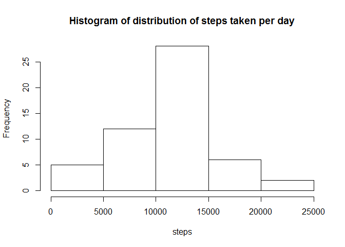

# Reproducible Research: Peer Assessment 1


## Loading and preprocessing the data

Load all nessesary R libraries

```r
library(dplyr)
library(data.table)
library(lattice)
library(ggplot2)
library(RCurl)
```

Load and un-archiv Zip file from the provided URL location into working directory:

```r
fileUrl <-"http://d396qusza40orc.cloudfront.net/repdata%2Fdata%2Factivity.zip" 
download.file (fileUrl, "data.zip")
unzip("data.zip")
survey <- read.table ("./activity.csv", sep=",", header = TRUE)
```


## What is mean total number of steps taken per day?

Calculate the total number of steps taken per day by grouping data frame by date and summarizing step counts

```r
summarized_date  <-
  survey %>%
  group_by(date) %>%
  summarize(steps = sum(steps)) 
summarized_date
```

```
## Source: local data frame [61 x 2]
## 
##          date steps
## 1  2012-10-01    NA
## 2  2012-10-02   126
## 3  2012-10-03 11352
## 4  2012-10-04 12116
## 5  2012-10-05 13294
## 6  2012-10-06 15420
## 7  2012-10-07 11015
## 8  2012-10-08    NA
## 9  2012-10-09 12811
## 10 2012-10-10  9900
## ..        ...   ...
```

Make a histogram of the total number of steps taken each day

```r
hist(summarized_date$steps, main = "Histogram of distribution of steps taken per day", xlab = "steps")
```

 

Calculate and report the mean and median of the total number of steps taken per day

```r
mean(summarized_date$step, na.rm=T)
```

```
## [1] 10766.19
```

```r
median (summarized_date$step, na.rm=T)
```

```
## [1] 10765
```

Number of taken steps has nearly normal distribusion.

Following is a boxplot that also demontraites this:

 

## What is the average daily activity pattern?


Calculate the total number of steps taken per interval by grouping data frame by interval and summarizing step counts 


```r
summarized_int  <-
  survey %>%
  group_by(interval) %>%
  summarize(steps = mean(steps, na.rm=T)) 
summarized_int
```

```
## Source: local data frame [288 x 2]
## 
##    interval     steps
## 1         0 1.7169811
## 2         5 0.3396226
## 3        10 0.1320755
## 4        15 0.1509434
## 5        20 0.0754717
## 6        25 2.0943396
## 7        30 0.5283019
## 8        35 0.8679245
## 9        40 0.0000000
## 10       45 1.4716981
## ..      ...       ...
```

Make a time series plot (i.e. type = "l") of the 5-minute interval (x-axis) and the average number of steps taken, averaged across all days (y-axis)

```r
plot(summarized_int, interval~steps, type="l", xaxt="n")
axis(1, at = seq(10, 2400, by = 100), las=2, cex.axis=0.8)
```

 

Which 5-minute interval, on average across all the days in the dataset, contains the maximum number of steps?

```r
filter (summarized_int, interval, steps>=max(summarized_int$steps))
```

```
## Source: local data frame [1 x 2]
## 
##   interval    steps
## 1      835 206.1698
```

Interval 835 corresponds to 2012-10-01 08:35:00 GMT. So it looks like subject is on average most active around that time of the day.

## Imputing missing values

Calculate and report the total number of missing values in the dataset (i.e. the total number of rows with NAs)

```r
missing<- length(which(is.na(survey$steps)))
```

Devise a strategy for filling in all of the missing values in the dataset. The strategy is to use the mean for that 5-minute interval.
Create a new dataset that is equal to the original dataset but with the missing data filled in.

```r
survey_fill <- survey
survey_fill <- merge(survey_fill, summarized_int, by = "interval", all = TRUE, sort = FALSE)
survey_fill$steps.x[is.na(survey_fill$steps.x)] <- round(survey_fill$steps.y[is.na(survey_fill$steps.x)])
summarized_fill_date  <-
  survey_fill %>%
  group_by(date) %>%
  summarize(steps.x = sum(steps.x)) 
summarized_fill_date
```

```
## Source: local data frame [61 x 2]
## 
##          date steps.x
## 1  2012-10-01   10762
## 2  2012-10-02     126
## 3  2012-10-03   11352
## 4  2012-10-04   12116
## 5  2012-10-05   13294
## 6  2012-10-06   15420
## 7  2012-10-07   11015
## 8  2012-10-08   10762
## 9  2012-10-09   12811
## 10 2012-10-10    9900
## ..        ...     ...
```

Make a histogram of the total number of steps taken each day

```r
hist(summarized_fill_date$steps.x, main = "Histogram of distribution of steps taken per day with NAs filled in", xlab = "steps")
```

 

Calculate and report the mean and median total number of steps taken per day. 

```r
mean(summarized_fill_date$steps.x)
```

```
## [1] 10765.64
```

```r
median (summarized_fill_date$steps.x)
```

```
## [1] 10762
```

Filing in NAs changed mean and median but values are very close from the estimates from the first part of the assignment.
Before NAs were filled in the values were:
```
mean = 10766.19
median = 10765
```
and after:
```
mean = 10765.64
median = 10762
```

In this particular case I do not think that filling in NAs caused any data squage but in some cases it may produce unreliable result.

## Are there differences in activity patterns between weekdays and weekends?
Create a new factor variable in the dataset with two levels - "weekday" and "weekend" indicating whether a given date is a weekday or weekend day.

```r
weekdays1 <- c('Monday', 'Tuesday', 'Wednesday', 'Thursday', 'Friday')
survey_fill$wDay <- factor((weekdays(as.Date(survey_fill$date)) %in% weekdays1), levels=c(FALSE, TRUE), labels=c('weekend', 'weekday'))
head(survey_fill)
```

```
##   interval steps.x       date  steps.y    wDay
## 1        0       2 2012-10-01 1.716981 weekday
## 2        0       0 2012-11-23 1.716981 weekday
## 3        0       0 2012-10-28 1.716981 weekend
## 4        0       0 2012-11-06 1.716981 weekday
## 5        0       0 2012-11-24 1.716981 weekend
## 6        0       0 2012-11-15 1.716981 weekday
```

Make a panel plot containing a time series plot (i.e. type = "l") of the 5-minute interval (x-axis) and the average number of steps taken, averaged across all weekday days or weekend days (y-axis).

```r
xyplot(steps.x ~ interval|wDay, data=survey_fill, type = "l",  xlab = "Interval",     ylab = "Number of steps", layout=c(1,2))     
```

 
